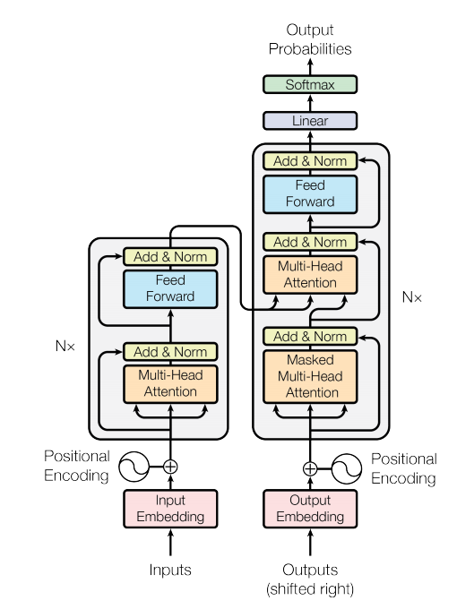

# transformers-from-scratch

In this repo I am going to implement different transformers architechtures from scratch using PyTorch from the paper "Attention is all you need"

                                                            Transformer Architechture
Enoder based Transformer  : Encoder based transformer is a architechture that has only encoder part. Many problems which has a encoder only objective has this type of architechture. For example BERT has a encoder based architechture. I have used positional embedding instead of positional encoding which is a little different from the paper.  
